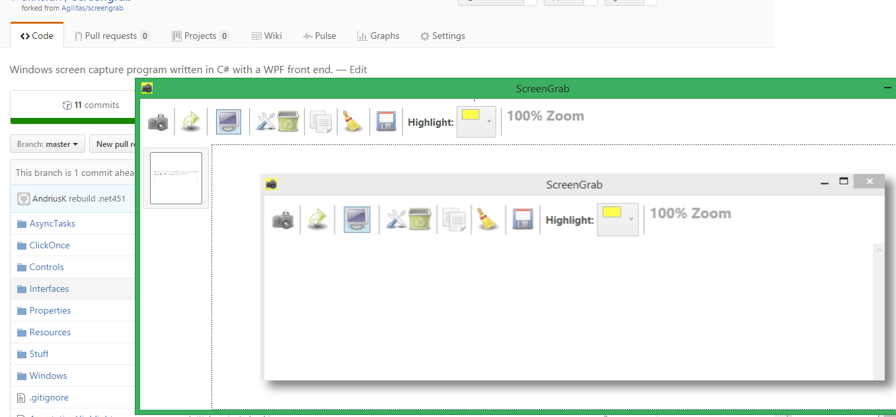

### ScreenGrab 
Windows screen capture program written in C# with a WPF front end.

Fork of https://github.com/Agilitas/screengrab

Modifications: 
 .net451 framework,  
 saving to .PNG images files.  

Features:
---------

* Multi monitor support
* Multiple captures
* Redo a previous capture (screen and position)
* Add coloured highlights
* Copy to clipboard
* Save to disk

Wishlist
--------

* Save as file name in toolbar, no file dialog
* Add more annotation tools:
* Pen
* Unfilled highlight
* Blur effect
* Text

